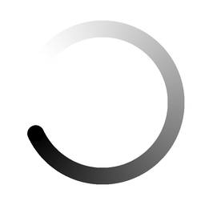

# Chat working

渐隐圆环旋转，深色圆头沿顺时针移动。源文件 256×256px，40 帧、每帧 30ms、1.2 秒无限循环；在 chat 中以 16×16 CSS 像素显示。

- `chat-working-light.gif`：白色背景，黑色渐隐圆环。
- `chat-working-dark.gif`：#202224 背景，白色渐隐圆环。
- `preview.html`：16px 实际尺寸与 128px 高清预览。
- `*-still.png`：透明背景的高清静态版本，用于减少动态效果偏好。

GIF 不支持半透明，渐变及抗锯齿分别合成于对应主题背景。

```html

```

仅用于正在处理的 chat；结束、暂停或报错时切换到对应状态。相邻已有状态文字时将 alt 设为空。减少动态效果偏好可参考预览页的静态替换。

运行 `python3 generate.py` 可重新生成（需要 Pillow 和 NumPy）。
